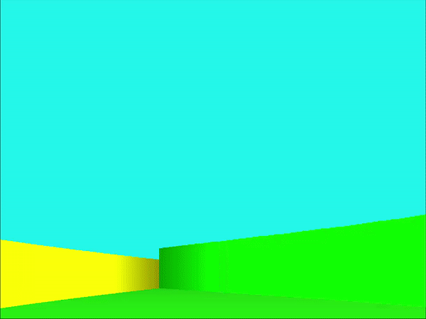
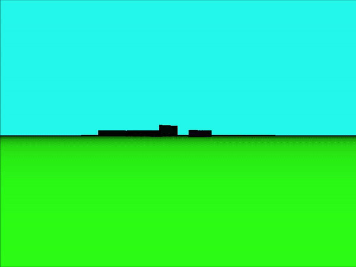

# Simple-Non-Orthogonal-Raycaster
An incredibly simple, non-orthogonal raycaster engine in C++

## Raycaster
  This 2.5D graphics engine is a raycaster. I wasn't sure entirely how a non-grid-based raycaster might be approached, so this is my unique stab at it. It uses line intersections (standard-form linear algebra) to determine if a ray hit a wall. This provides near-perfect floating-point accuracy for distances between the player and each point along the wall. Because the ray distances are not determined by incrementing and checking for a wall-hit, there are no limitations for draw-distance. The engine (as far as I'm aware) can draw player view-rays to any length without significant slowdown. I have also implemented small debugging features including a top-down minimap view shown by pressing "m" and a simple debugging stat overlay shown by pressing "/." These were just for my own debugging purposes and can be adapted to suit other debugging needs. The map is hardcoded, but could be adapted for implementation in a map file. The code would just have to be changed to read the map object from there instead of it being harcoded.
  
## Features
  This raycaster, as previously mentioned, features light debugging tools and a minimap. It is more a contribution to my growing understanding of 2.5D rendering than a final product, so there is a lot of features who's framework for implementation has been laid out, but not yet the specific feature (Eg. The game engine has an entire font/typing method, but utilizes it only for FPS counting). I more designed it for a simple implementation of common raycasting features. It does not yet have texture-mapping, but ssloy's raycaster shows how to do that easily. My design, however, includes horizontal as well as vertical look (y-shearing) with the arrow keys and full "wasd" character movement, a map and distance-based lighting system, multi-height and multi-color walls, etc. Most of these (the vertical look, wall heights, and line intersection ray casting) were things I only read about but did not see an implementation for, so my versions might be sub-optimal, although I think they are the best way of doing things.
  

  
## Graphics
  My graphics programming experience in c++ has come relatively recently. I use the SDL library to output a frame buffer to the screen as a texture. I tried to make it as portable as possible by not utilizing any SDL-specific methods except those done to put the image on screen. All visuals are entirely software-rendered! This means that the code can be very easily ported to use whatever graphics library is best, although SDL is incredibly versatile. 
  
## Libraries
The libraries used are:
- [SDL](https://www.libsdl.org/download-2.0.php)
- [STB Image Loader](https://github.com/nothings/stb)
  
## Resources
  My introduction to raycasting and graphics programming in general was with [ssloy's](https://github.com/ssloy) [tinyracaster project](https://github.com/ssloy/tinyraycaster). I like the simple approach he takes to graphics and resultingly, there will exist some similarities in the backbones of our code (display methods, framebuffers, etc.), so be sure to check out his great projects for a more in-depth explanation of some of the methods used.
  
## Bugs: 
  It is important to note that I am one individual just beginning graphics programming in c++ at the time of this engine's creation. There are bugs in my code. A known one is that walls with unreal and 0 slopes do not render correctly. I do not plan to work any more on this project in significant ways. I have accomplished what I wanted and want to share my take on non-orthogonal raycasting. It is not entirely well-optimized. The code was designed with simplicity in mind. I suggest compiling with g++ and the -o3 optimization flag for good performance.
  

